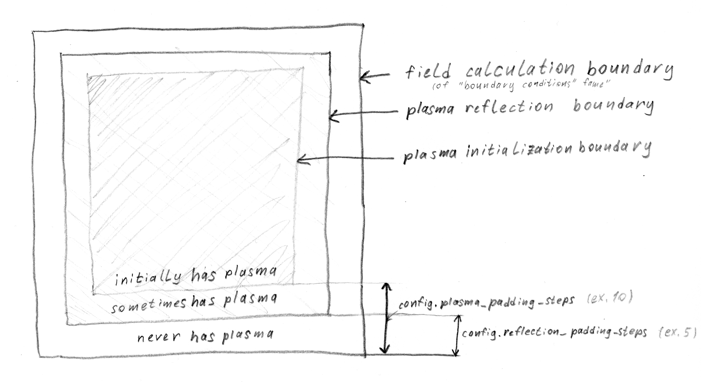

Simulation window and grids
===========================

Fields and densities grid
-------------------------

.. figure:: ../illustrations/cell_grid.png

   The grid on which the fields and densities are calculated.

Fields and densities (:math:`ro`, :math:`j`) are calculated on a
``config.grid_steps`` x ``config.grid_steps``-sized grid.
This number must be odd in order to have an on-axis cell
for on-axis diagnostics.

.. autodata:: config_example.grid_steps

.. autodata:: config_example.grid_step_size

The fields are calculated at the centers of the grid cells.

.. note::
   The muddy 'window width' concept is no longer referenced in LCODE 3D
   to ease up the inevitable confusion about what it actually means
   and how it relates to ``config.grid_step_size``.
   Please refrain from thinking in these terms
   and head over to the following subsectionf for more useful ones.

.. _reflect_and_plasma_boundaries:

Reflect and 'plasma' boundaries
-------------------------------

   The reflect and plasma boundaries illustrated.

The plasma partlcles are not allowed to enter the outermost cells
in order to simplify the treatment of boundary regions
during interpolation, deposition and field calculation.
In order to achieve that, the reflection boundary is placed
``config.reflection_padding_steps`` steps deeper into the simulation area.

.. note::
   While choosing the value for this parameter, one should take into account
   the particle size. Even a single fine
   [:doc:`Coarse/fine plasma <../tour/coarse_and_fine_plasma>`]
   particle is three cells wide
   [:doc:`Plasma <../tour/plasma>`],
   so the gap width should be wide enough to cover the entire coarse particle cloud
   size.
   Failure to meet this condition may result in a memory violation error.

Note that while it defines the area where plasma is allowed to be present,
it must be larger than the area where the plasma is initially positioned.
The size of the second area is controlled by the
``config.plasma_padding_steps``,
which puts a cut-off limit on the placement
of both coarse and fine plasma particles.

Coarse and fine plasma grids
----------------------------

Finally, the plasma boundary hosts two grids of particles,
the coarse grid and the fine grid
[more info in :doc:`Coarse/fine plasma approach <../tour/coarse_and_fine_plasma>`],
which are coarser and finer than the field grid respectively.
