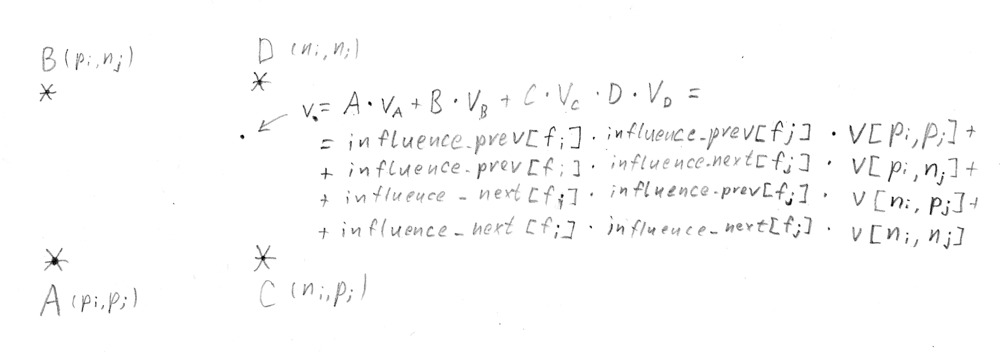

Coarse and fine plasma
======================

Concept
-------
In order to increase stability and combat transverse grid noise,
LCODE 3D utilises a dual plasma appoach.

.. figure:: ../illustrations/virtplasma.png

   Positioning of the coarse and fine particles in dual-plasma approach.

Coarse particles are the ones that get tracked throughout the program,
and pushed by the pusher. There coarse plasma grid is many times more sparse
than the fields grid, think :math:`\frac{1}{9}` particles per cell.

.. autodata:: config_example.plasma_coarseness

Fine particles only exist inside the deposition phase.
There are several fine particles per cell, think :math:`4` or more.
Their characteristic values are neither stored or evolved;
instead they are intepolated from the coarse particle grid inside
the deposition process.

.. autodata:: config_example.plasma_fineness

Initialization
--------------
.. autofunction:: lcode.make_coarse_plasma_grid

.. autofunction:: lcode.make_fine_plasma_grid

   * ``fineness=3`` (and ``coarseness=2``)::

       +-----------+-----------+-----------+-----------+
       | .   .   . | .   .   . | .   .   . | .   .   . |
       |           |           |           |           |   . - fine particle
       | .   .   . | .   *   . | .   .   . | .   *   . |
       |           |           |           |           |   * - coarse particle
       | .   .   . | .   .   . | .   .   . | .   .   . |
       +-----------+-----------+-----------+-----------+

   * ``fineness=2`` (and ``coarseness=2``)::

       +-------+-------+-------+-------+-------+
       | .   . | .   . | .   . | .   . | .   . |           . - fine particle
       |       |   *   |       |   *   |       |
       | .   . | .   . | .   . | .   . | .   . |           * - coarse particle
       +-------+-------+-------+-------+-------+

.. autofunction:: lcode.make_plasma

   Initializing coarse particles is pretty simple:
   ``coarse_x_init`` and ``coarse_y_init`` are broadcasted output of :func:`make_coarse_plasma_grid`.
   ``coarse_x_offt`` and ``coarse_y_offt`` are zeros and so are ``coarse_px``, ``coarse_py`` and ``coarse_pz``.
   ``coarse_m`` and ``coarse_q`` are constants divided by the factor of coarsness by fineness squared
   because fine particles represent smaller macroparticles.

   Initializing fine particle boils down to interpolation coefficients
   (``influence_prev`` and ``influence_next``)
   and the indices of the coarse particles (``indices_prev``, ``indices_next``)
   that the characteristics will be intepolated from.

   ``influence_prev`` and ``influence_next`` are linear interpolation coefficients
   based on the initial closest coarse particle positioning.
   Note that these are constant and do not change in :math:`\xi`.
   The edges get special treatment later.

   ``indices_next`` happens to be pretty much ``np.searchsorted(coarse_grid, fine_grid)``
   and ``indices_prev`` is basically ``indices_next - 1``,
   except for the edges,
   where a fine particle can have less than four 'parent' coarse particles.
   For such 'outer' particles, existing coarse particles are used instead,
   so clipping the indices and fixing ``influence``-arrays is carried out.

   Note that these arrays are 1D for memory considerations.

   The function returns the coarse particles and ``virtparams``:
   a ``GPUArrays`` instance
   that conveniently groups the fine-particle related arrays,
   which only matter during deposition,
   under a single name.

Coarse-to-fine interpolation
----------------------------

.. figure:: ../illustrations/virtplasma_moved.png

.. autofunction:: lcode.mix

   This is just a shorthand for the characteristic value mixing
   for internal use in ``coarse_to_fine``.

.. autofunction:: lcode.coarse_to_fine

   The internals are pretty straightforward
   once you wrap your head around the indexing.

   A single fine particle with the indices ``[fi, fj]``
   (in fine particles ``virt_params`` 1D arrays)
   is interpolated from four particles with indices
   ``[pi, pj]``, ``[pi, nj]``, ``[ni, pj]``, ``[ni, nj]``
   (in coarse particles ``c_*`` arrays)
   and four weights ``A``, ``B``, ``C``, ``D`` respectively.
   The weights are, in turn, composed as a products of
   values from ``influence_prev`` and ``influence_next`` arrays,
   indiced, once again, with ``[fi, fj]``.
   It would be convenient to calculate them beforehand,
   but they are recalculated instead as a result of time-memory tradeoff.

   Finally, momenta, charge and mass are scaled
   according to the coarse-to-fine macrosity coefficient
   discussed above.

Alternative illustration
------------------------

.. plot::

   import numpy as np
   import matplotlib as mpl
   import matplotlib.pyplot as plt

   XI_STEPS, XI_STEP_SIZE = 12, .1
   LIM = .5

   def make_coarse_plasma_grid(steps, step_size, coarseness=3):
       plasma_step = step_size * coarseness
       right_half = np.arange(steps // (coarseness * 2)) * plasma_step
       left_half = -right_half[:0:-1]  # invert, reverse, drop zero
       plasma_grid = np.concatenate([left_half, right_half])
       return plasma_grid

   def make_fine_plasma_grid(steps, step_size, fineness=2):
       plasma_step = step_size / fineness
       if fineness % 2:  # some on zero axes, none on cell corners
           right_half = np.arange(steps // 2 * fineness) * plasma_step
           left_half = -right_half[:0:-1]  # invert, reverse, drop zero
       else:  # none on zero axes, none on cell corners
           right_half = (.5 + np.arange(steps // 2 * fineness)) * plasma_step
           left_half = -right_half[::-1]  # invert, reverse
       plasma_grid = np.concatenate([left_half, right_half])
       return plasma_grid

   cells = make_coarse_plasma_grid(XI_STEPS, XI_STEP_SIZE, coarseness=1)
   for x in cells:
      for y in cells:
         r = mpl.patches.Rectangle((x - XI_STEP_SIZE / 2, y - XI_STEP_SIZE / 2),
                                   XI_STEP_SIZE, XI_STEP_SIZE,
                                   linewidth=.3,
                                   edgecolor='black', facecolor='none')
         plt.axes().add_patch(r)
   cell_x, cell_y = np.meshgrid(cells, cells)
   plt.scatter(cell_x, cell_y, marker='+', color='red', s=.1)

   fine = make_fine_plasma_grid(XI_STEPS, XI_STEP_SIZE, fineness=2)
   fine_x, fine_y = np.meshgrid(fine, fine)
   plt.scatter(fine_x, fine_y, marker='.', color='blue', s=10)

   coarse = make_coarse_plasma_grid(XI_STEPS, XI_STEP_SIZE, coarseness=3)
   coarse_x, coarse_y = np.meshgrid(coarse, coarse)
   plt.scatter(coarse_x, coarse_y,
               marker='.', color='green', facecolor='none', s=80)

   plt.xlim(-LIM, LIM)
   plt.ylim(-LIM, LIM)
   plt.axes().set_aspect('equal')
   plt.show()
