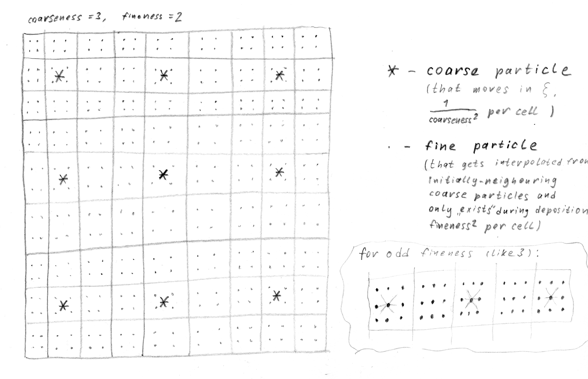

Coarse and fine plasma
======================

   Positioning of the coarse and fine particles in dual-plasma approach.

.. autofunction:: lcode.make_coarse_plasma_grid

.. autofunction:: lcode.make_fine_plasma_grid

   * ``fineness=3`` (and ``coarseness=2``)::

       +-----------+-----------+-----------+-----------+
       | .   .   . | .   .   . | .   .   . | .   .   . |
       |           |           |           |           |   . - fine particle
       | .   .   . | .   *   . | .   .   . | .   *   . |
       |           |           |           |           |   * - coarse particle
       | .   .   . | .   .   . | .   .   . | .   .   . |
       +-----------+-----------+-----------+-----------+

   * ``fineness=2`` (and ``coarseness=2``)::

       +-------+-------+-------+-------+-------+
       | .   . | .   . | .   . | .   . | .   . |           . - fine particle
       |       |   *   |       |   *   |       |
       | .   . | .   . | .   . | .   . | .   . |           * - coarse particle
       +-------+-------+-------+-------+-------+

Alternative illustration
------------------------

.. plot::

   import numpy as np
   import matplotlib as mpl
   import matplotlib.pyplot as plt

   XI_STEPS, XI_STEP_SIZE = 12, .1
   LIM = .5

   def make_coarse_plasma_grid(steps, step_size, coarseness=3):
       plasma_step = step_size * coarseness
       right_half = np.arange(steps // (coarseness * 2)) * plasma_step
       left_half = -right_half[:0:-1]  # invert, reverse, drop zero
       plasma_grid = np.concatenate([left_half, right_half])
       return plasma_grid

   def make_fine_plasma_grid(steps, step_size, fineness=2):
       plasma_step = step_size / fineness
       if fineness % 2:  # some on zero axes, none on cell corners
           right_half = np.arange(steps // 2 * fineness) * plasma_step
           left_half = -right_half[:0:-1]  # invert, reverse, drop zero
       else:  # none on zero axes, none on cell corners
           right_half = (.5 + np.arange(steps // 2 * fineness)) * plasma_step
           left_half = -right_half[::-1]  # invert, reverse
       plasma_grid = np.concatenate([left_half, right_half])
       return plasma_grid

   cells = make_coarse_plasma_grid(XI_STEPS, XI_STEP_SIZE, coarseness=1)
   for x in cells:
      for y in cells:
         r = mpl.patches.Rectangle((x - XI_STEP_SIZE / 2, y - XI_STEP_SIZE / 2),
                                   XI_STEP_SIZE, XI_STEP_SIZE,
                                   linewidth=.3,
                                   edgecolor='black', facecolor='none')
         plt.axes().add_patch(r)
   cell_x, cell_y = np.meshgrid(cells, cells)
   plt.scatter(cell_x, cell_y, marker='+', color='red', s=.1)

   fine = make_fine_plasma_grid(XI_STEPS, XI_STEP_SIZE, fineness=2)
   fine_x, fine_y = np.meshgrid(fine, fine)
   plt.scatter(fine_x, fine_y, marker='.', color='blue', s=10)

   coarse = make_coarse_plasma_grid(XI_STEPS, XI_STEP_SIZE, coarseness=3)
   coarse_x, coarse_y = np.meshgrid(coarse, coarse)
   plt.scatter(coarse_x, coarse_y,
               marker='.', color='green', facecolor='none', s=80)

   plt.xlim(-LIM, LIM)
   plt.ylim(-LIM, LIM)
   plt.axes().set_aspect('equal')
   plt.show()
